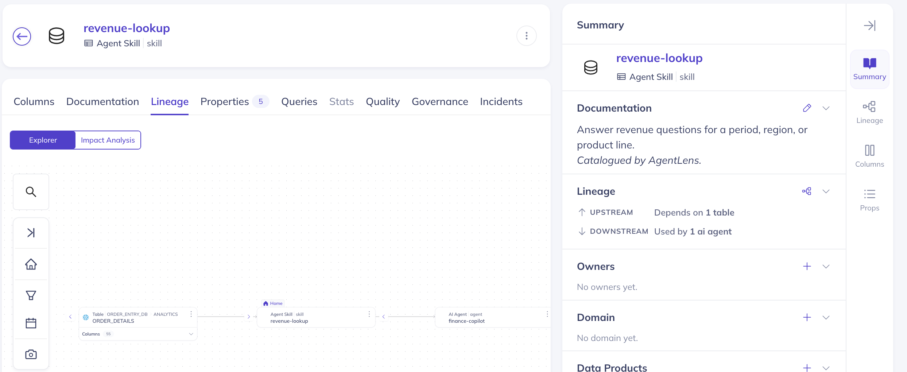

# AgentLens

**Lineage for your AI agents.**

> **Reviewing this?** Start with **[SUBMISSION.md](SUBMISSION.md)** — what this
> is trying to achieve, where the design is unsettled, and the open questions.
> The DataHub-side diff is 4 files, in **[datahub-patch/](datahub-patch/)**.
> Cold start in **[RUNBOOK.md](RUNBOOK.md)**.

Your dashboards have lineage. Your agents don't.

When you drop a column and a dashboard depends on it, the dashboard *errors* —
someone gets paged, someone notices. When an agent's skill says "sum
`line_total` from `analytics.order_details`" and that column quietly changes
meaning, the agent doesn't error. It confidently returns a number that's wrong,
and nobody finds out until a decision has been made on it.

AgentLens scans your agent repositories, catalogues every agent, skill and MCP
tool into DataHub as a first-class asset with real lineage back to the
warehouse tables they read, and then answers the question nobody can answer
today:

> If I change this table, which agents break?



*DataHub's own UI, unmodified. The lineage row reads `ORDER_DETAILS` →
`revenue-lookup` (Agent Skill) → `finance-copilot` (AI Agent), and the Summary
panel says **"DOWNSTREAM — Used by 1 ai agent."** That sentence is DataHub's,
generated from the `AI Agent` subtype AgentLens emits — no patch, no fork.*

---

## What it does

```
   repo scan            URN resolution          emit                traversal
  -----------          ----------------       --------           -------------
  .mcp.json      -->   match table refs  -->  agents, skills  -->  downstream
  SKILL.md             against the            and tools as         walk finds
  agentlens.yaml       live catalog           catalog assets       the agents
```

The five that do the work:

```bash
agentlens scan    demo-repo --repository github.com/acme/data-agents
agentlens emit    manifest.json
agentlens guard   "<urn-of-a-table-youre-about-to-change>" --reason "dropping line_total"
agentlens sandbox order_details --drop-column line_total
agentlens drift   demo-repo --repository github.com/acme/data-agents
```

Four more put the answer where people already look — `explore`, `serve`, `link`
and the DataHub tab. See [Inside DataHub's UI](#inside-datahubs-ui).

`guard` runs the full loop DataHub describes — **read** the graph, **decide**,
**write results back**:

```
[1/3] READ - walking downstream lineage
  read via: aspects  -  10 AgentLens node(s) examined
  3 agent(s), 4 skill(s) degrade.
  AGENTS
    - growth-analyst   (2 hops)  [growth-eng]
    - finance-copilot  (2 hops)  [fpa-platform]
    - catalog-steward  (2 hops)  [data-platform]

[2/3] DECIDE - 3 agent(s) affected, acting

[3/3] WRITE BACK
  tagged upstream `has-agent-consumers`  (growth-analyst, finance-copilot, catalog-steward)
  tagged 7 downstream asset(s) `agent-context-review`
```

The important write is the first one, and it isn't on an asset AgentLens owns.
The Snowflake table now carries a `has-agent-consumers` tag — knowledge that
did not exist in the graph before, on an asset anyone browsing DataHub will
see. Writes to assets we don't own go through `DatasetPatchBuilder` so existing
tags are never clobbered.

`--github-repo owner/name` also opens an issue on the repository that owns the
affected agents. `--dry-run` shows what would be written without writing it.

---

## Inside DataHub's UI

A finding that lives in a terminal reaches whoever ran the command. The person
who drops the column is looking at the table in DataHub.

So the simulation is also an entity tab, sitting next to **Lineage**, built out
of DataHub's own components:

```bash
python -m agentlens.cli serve --port 8000     # the fleet payload
cd path/to/datahub/datahub-web-react && npx yarn@1.22.22 vite
```

Open `localhost:3000`, find a table your agents read, and there is an **Agents**
tab with a robot icon. Pick a change — drop a column, rename the table, drop it
— and it answers immediately, with the number lineage gives you set beside the
number that's true:

> Lineage-only impact analysis flags every consumer of this table: **7**.
> AgentLens says **3**, because only some name `line_total` in their skill text.
> 4 would have been chased for nothing.

Three things about how it's wired:

**The tab appears on exactly the tables agents read.** `display.visible` is
keyed off the `has-agent-consumers` tag that `guard` writes. The tag arrives in
`globalTags`, which the dataset query already fetches, so gating it costs no
extra request — and the tab is absent everywhere else rather than being present
and empty. The write-back isn't decoration; it's what drives the UI.

**No fork of the backend.** `datahub-web-react` is a Vite app whose dev server
proxies to `localhost:9002` — the quickstart you're already running. A
`/agentlens` proxy entry alongside it forwards to `agentlens serve`, so the
tab's `fetch` is same-origin and there's no CORS and no build step. Three
processes, no Docker image rebuild.

**The CLI stays authoritative.** The tab runs a TypeScript port of
`sandbox.py::simulate()` so clicking is instant, and prints the `agentlens
sandbox` command that reproduces what you're looking at. If the two ever
disagree, the one that gates CI wins.

If you'd rather not run a React dev server, `agentlens explore` writes the same
thing as a single self-contained HTML file, and `agentlens link` puts it in the
entity sidebar of every table the fleet reads via `institutionalMemory` — no
frontend changes at all. `RUNBOOK.md` §7–8 covers both paths.

---

## Sandbox — ask about a change that hasn't happened

DataHub's impact analysis is read-only and always about the graph as it is
*now*. There's no what-if: nothing lets you apply a proposed change to a copy
of the graph and ask what it would break. I checked all 71 entity types on
master and the docs — no sandbox, no branch, no simulation.

```bash
agentlens sandbox order_details --drop-column line_total
```

```
  Proposed:  analytics.order_details.line_total
  Forked:    7 downstream node(s)

  BREAKS     margin-analysis  names line_total in its text
  BREAKS     revenue-lookup   names line_total in its text
  DEGRADES   finance-copilot  via margin-analysis, revenue-lookup  [fpa-platform]
  UNCHANGED  catalog-steward  none of its skills name the change   [data-platform]
  UNCHANGED  growth-analyst   none of its skills name the change   [growth-eng]
  UNCHANGED  churn-risk       reads the table but never names line_total
  UNCHANGED  ownership-audit  reads the table but never names line_total

  2 break, 1 degrade, 4 unaffected
```

Compare that with what `guard` says about the same table: **3 agents and 4
skills degrade.** Both are right. All seven of those nodes read
`order_details`, so the lineage graph flags every one of them — but the change
is to a *column*, and only two skills name it. Lineage can't make that
distinction. It has no column in it, and no notion of a change that hasn't
happened.

That's the whole feature: turning "everything downstream is at risk" into
"these two, and here's the line of markdown that proves it."

It writes nothing. `--promote --reason "..."` records the finding through the
same `Actions` used by `guard`, so a simulation you decide to keep becomes a
tag on the upstream table. It also runs entirely offline from `manifest.json`
and the repo — no GMS, no lineage cache — so it's deterministic and works on a
plane.

Also supports `--rename-to <name>` and `--drop-table`. Exits `1` when anything
breaks, so it gates CI like `drift` does.

---

## Drift

A scan is a snapshot. That's the whole objection to hand-maintained agent
metadata — a typed-out list of tables is wrong the week after it's written — so
it applies to AgentLens too unless something checks.

```bash
agentlens drift demo-repo --repository github.com/acme/data-agents
```

```
  6 change(s) since the catalog was last written

  BROKEN   ownership-audit        analytics.events no longer resolves
  REF +    churn-risk             analytics.subscriptions
  REF -    funnel-report          analytics.sessions
  CHANGED  revenue-lookup         instructions 4a91c2 -> e70b18
  GONE     skill.legacy-forecast  in the catalog, not in the repo
  NEW      margin-analysis        in the repo, not in the catalog
```

`BROKEN` is a governance finding, not a scan failure: the skill names a table
the catalog doesn't have, so either the table was renamed or dropped and that
agent has been failing quietly, or the table exists and was never catalogued.
Both are things a data team wants to know.

It exits `1` when it finds drift and `0` when it doesn't, so it drops into CI
unchanged. `--exit-zero` to report only.

`./demo.sh` runs the whole thing end to end: it emits, checks drift (clean),
repoints a skill at a different table by editing one line of markdown, and
checks again. Nothing touches DataHub between those two checks — which is the
point. The edit is reverted afterwards, so the demo is idempotent.

---

## Quickstart

Requires a running DataHub. `datahub docker quickstart` is enough.

```bash
git clone https://github.com/<you>/agentlens && cd agentlens
pip install -r requirements.txt

export DATAHUB_GMS_URL=http://localhost:8080
export DATAHUB_GMS_TOKEN=your-token      # any string if auth is off

python -m agentlens.cli scan demo-repo --repository github.com/acme/data-agents
python -m agentlens.cli emit manifest.json
python -m agentlens.cli guard "urn:li:dataset:(...)" --reason "dropping a column" \
    --html examples/blast-radius.html
```

Then open `localhost:9002` → Browse → **agentlens** to see the fleet, or the
Lineage tab of any table your agents read.

Tested on Python 3.11 and 3.12. The DataHub CLI prints a warning above 3.11;
it's advisory and nothing here is affected.

---

## Example output

No setup required to look at these:

- [`examples/blast-radius.html`](examples/blast-radius.html) — a self-contained
  impact report. Open it in any browser.
- [`examples/guard-run.json`](examples/guard-run.json) — the same run as
  structured data, including everything written back.

---

## How agents are modelled, and why

DataHub added `aiAgent`, `agentSkill` and `api` as first-class entities in
[#18478](https://github.com/datahub-project/datahub/pull/18478), merged to
master on 19 July 2026. They are **not in any release**: v1.6.0 was tagged
21 May and is still the latest. Emitting one against v1.6.0 returns:

```
400 {"error":"Failed to find entity with name aiAgent in EntityRegistry"}
```

`entity-registry.yml` has 71 entities on master and 64 on v1.6.0, and the
difference is exactly `aiAgent`, `agentSkill`, `api`, `metric`, `repository`,
`semanticModel`, `service`. There's no `AIAgentInfoClass` in `acryl-datahub`
1.6.0.15 either, so there's no SDK path on a released build.

Worth knowing if you go looking: `docs.datahub.com` serves the `aiAgent` page
under a version selector reading **1.6.0**. The docs site builds from master
but hard-labels it with the last release number
(`docs-website/docusaurus.config.js`: `versions: { current: { label: "1.6.0",
banner: 'none' } }`), so anything merged after a release tag publishes as
though it shipped.

Reproduce all of it yourself: [`tools/probe_v2.py`](tools/probe_v2.py).

So AgentLens models agents, skills and tools as **datasets in a dedicated
`agentlens` platform**, separated by subtype (`AI Agent`, `Agent Skill`,
`MCP Tool`), with agent metadata in custom properties. This is a standard
DataHub pattern for non-table assets, and it means the demo runs on a stock
quickstart.

It costs nothing later. `upstreamLineage` is dataset-to-dataset in both models,
so every traversal in `impact.py` is byte-for-byte what it would be against
native entities. When they ship, only `emitter.py` changes:

| AgentLens manifest | Native aspect (on master) |
|---|---|
| `skill.instructions` | `agentSkillInfo.instructions` |
| `skill.source_path` + `repository` | `agentSkillInfo.sourceRepository.{url,path}` |
| `skill.tools` | `agentSkillInfo.requiredTools` → `api` |
| `agent.skills` | `aiAgentDependencies.skills` |
| `agent.owner_team` | `ownership` |
| `agent.data_refs` | `upstreamLineage` |

---

## How lineage is read, and why it isn't GraphQL

DataHub exposes two GraphQL lineage reads, backed by two different caches:

- `Dataset.lineage` — `LineageInput` has no `skipCache` and no `searchFlags`
  member to borrow one from. There is no opt-out.
- `searchAcrossLineage` — `SearchAcrossLineageInput.searchFlags.skipCache`
  exists, but that is a different cache again.

Measured on GMS v1.5.0.6: after removing lineage, `searchAcrossLineage` was
still stale past 120s, while `Dataset.lineage` was stale at t+0 and clean from
t+30. Disagreement is decisive here — one cache cannot answer two ways.

This matters because `emit` is immediately followed by `guard`, which is t+0 —
inside that window. An empty traversal and a genuinely clear table look
identical in the output, and reporting the first as the second is precisely the
failure this tool exists to prevent.

So the default read path is neither lineage field. AgentLens enumerates its
nodes and reads each one's `upstreamLineage` **stored aspect**, then inverts
those edges locally. Stored aspects aren't served from either cache.
`--lineage-source graphql` restores the old behaviour, and the report says so.

`render()` will not print a clean bill of health for a traversal it couldn't
complete, or one that examined zero nodes — those three states are reported
separately, and `tests/test_impact_safety.py` fails if they ever collapse back
into one.

Scope: this is entity-level (table-level). `LineageInput` takes no column
parameter and the stored aspect is entity-level too.

Thanks to **ogze** in the DataHub community Slack, who ran the cache experiment
with the criterion fixed before the run, and to **Adrian Machado** for pointing
at the release boundary.

---

## What it doesn't do

Worth knowing before you trust it:

- **Table extraction is regex over skill text, not a SQL parser.** SQL aliases
  are resolved, so `FROM analytics.orders o` means `o.created_at` is correctly
  read as a column and not a table. But an agent that builds queries
  dynamically at runtime is invisible to it.
- **It's static analysis of repositories, not runtime observation.** It sees
  what a skill *says* it reads, not what it actually executed.
- **Resolution is name matching against the catalog**, scored (exact → suffix
  → leaf → substring) rather than first-hit. Unresolved references are printed
  rather than silently dropped — a skill referencing a table that isn't in the
  catalog is itself a governance finding.
- **The catalog is a snapshot between scans.** `agentlens drift` is how you
  find out it has gone stale; nothing detects it for you automatically.

On the bundled demo repo: **9 table references extracted, 8 resolved.** The
ninth is `analytics.events`, which genuinely isn't in the showcase dataset.

---

## Tests

```bash
pip install -e ".[dev]"
ruff check . && mypy agentlens && pytest -q
```

Most tests need neither DataHub nor a network — integration tests detect
whether GMS is reachable and skip themselves if not, so a cold clone runs
green. The two that matter most, `test_impact_safety.py` and `test_drift.py`,
are pure functions over hand-built inputs: the failures they guard against are
silent ones, so they need tests that are loud.

---

## License

Apache 2.0.
